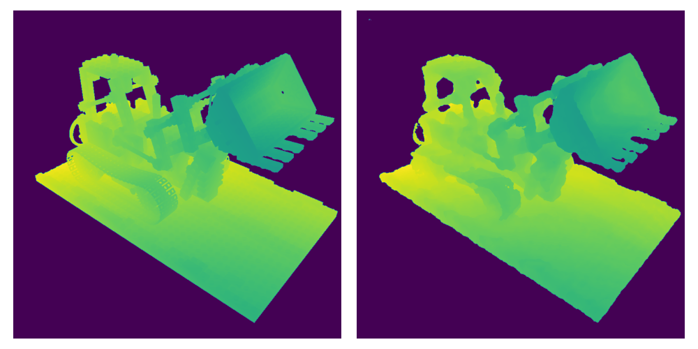

Train neural network to predict ray intersections. This repository explores two types of tasks:
1. Reconstruct model from multiview images with depth channel;
2. Learn model representations from randomly sampled rays (requires 3D model and ray tracing)

## 1. Multiview Reconstruction

Download Blender dataset from [Google Drive](https://drive.google.com/file/d/1xjGKFszIP8dX7i_kOFq3RFZ7tSJHzPQM/view). Use browser or [gdown](https://github.com/wkentaro/gdown):
```
gdown 1xjGKFszIP8dX7i_kOFq3RFZ7tSJHzPQM
```
Update `config/multiview.yaml` and run training with `python main.py -cn multiview`.

## 2. Sample Rays with Ray Tracing

Download Blender Bulldozer: [Google Drive folder](https://drive.google.com/drive/folders/1R_dUallEeDikQCaeFXthXS4b2XFHJQvc?usp=sharing)
contains original `.blend` file (zip archive) and `.stl` model. `gdown` command:
```
gdown 1R_dUallEeDikQCaeFXthXS4b2XFHJQvc --folder
```

Generate rays from `.stl` with `python generate_rays.py` (update path to 3D model in `generate_rays.py` first).

Update `config/raytrace.yaml` and run training with `python main.py -cn raytrace`.

## Notable Requirements
- [tiny-cuda-nn](https://github.com/NVlabs/tiny-cuda-nn): `pip install git+https://github.com/NVlabs/tiny-cuda-nn/#subdirectory=bindings/torch`
- [trimesh](https://trimesh.org/) with Embree

## Ideas
- [x] **MLP Model**: fast
- [x] **Transformer Model**: parameter efficient, slow
- [x] **Transformer without Attention (lol)**: points are independent, room for speedup
- [ ] **Binary Search Model**: faster than Transformer
- [ ] **Pretrain and freeze Hash Grid** to reuse parameters
- [ ] **Compute camera point embedding only once** to render whole image
- [ ] **Train transformer classifier on edge rays** (hard to implement)
- [ ] **Give MSE more weight near sharp corners**: combat blur

## Results

First (weird) table with model comparison. Models are:
1. **MLP**, size determined by `dim` and `n_layers`. Small: `(128, 6)`; Medium: `(256, 8)`; Large: `(384, 12)`.
2. **Full Transformer**, size determined by `dim` and `n_layers`. Small: `(16, 2)`; Medium: `(24, 3)`; Large: `(32, 4)`. **Note**: each layers contains 6 MLPs.
3. **Transformer without attention (lol)**.
4. **Transformer without attention (lol), without norm**.

Hash Grid Encoding contains tables of size 2048, takes 0.2 MB disk space.

Columns:
- **NP**: number of points sampled on a ray
- **#i**: `MSE` on camera render for a corresponding model
- **t2**: frames per second for `800 x 800` image. Full PyTorch
- **t1**: same as `t1` but MLPs are from `tiny-cuda-nn`
- **p**: parameters weight in MB

|Size|NP|#1|t1|t2|p|#2|t1|t2|p|#3|t1|t2|p|#4|t1|t2|p|
|---|---|---|---|---|---|---|---|---|---|---|---|---|---|---|---|---|---|
|Small|8|**7.39**|18.3|20.7|0.38|**8.65**|8.6|8.5|0.02|**8.35**|10.6|10.6|0.02|**9.00**|13.5|10.4|0.02|
|Small|16|**4.55**|19.9|19.3|0.50|**5.45**|5.5|5.6|0.02|**5.14**|9.4|9.2|0.02|**5.32**|11.6|11.2|0.02|
|Small|32|**3.62**|18.8|20.8|0.75|**3.47**|2.4|2.0|0.02|**3.30**|4.1|3.0|0.02|**3.80**|6.0|3.8|0.02|
|Medium|8|**6.63**|18.6|19.2|1.75|**8.34**|6.8|7.0|0.08|**8.11**|9.5|10.0|0.05|**8.63**|13.2|10.3|0.05|
|Medium|16|**4.46**|20.1|19.4|2.00|**4.98**|3.7|3.6|0.08|**4.79**|7.2|6.6|0.05|**5.33**|11.8|9.3|0.05|
|Medium|32|**3.32**|18.7|18.3|2.50|**3.14**|1.7|1.6|0.08|**3.28**|3.3|3.0|0.05|**3.89**|6.0|4.4|0.05|
|Large|8|**6.57**|18.4|15.8|6.00|**7.87**|6.0|5.4|0.16|**7.09**|8.0|7.5|0.10|**nan**|12.0|8.6|0.11|
|Large|16|**4.35**|18.5|16.2|6.38|**4.49**|2.7|2.6|0.16|**4.40**|5.4|5.3|0.10|**5.63**|11.5|8.2|0.11|
|Large|32|**3.41**|20.1|13.7|7.13|**3.08**|1.0|0.9|0.16|**3.15**|2.3|1.8|0.10|**nan**|4.6|2.3|0.11|

#### Example of `target` / `predicted`:
